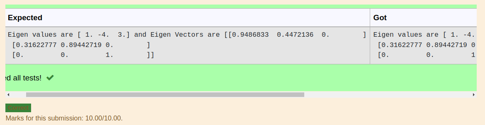

# EIGENVALUES-AND-EIGENVECTORS
## Aim:
To write a python program to find the Eigenvalues and Eigen Vectors
## Equipment’s required:
1. 	Hardware – PCs
2. 	Anaconda – Python 3.7 Installation / Moodle-Code Runner
## Algorithm:
### Step1 : import numpy as np
###Step 2: get input as a=np.array(eval(input()))
###Step 3: Using the np.linalg.eig(), we get two results (first is eigenvalue and second is eigenvector) of the given matrix.
###Step 4: #Program to find the eigen values and eigen vectors.

## Program:
```#Program to find the eigen values and eigen vectors.
#Developed by:S.E.Elamaran
#RegisterNumber:22000420
import numpy as np
a=np.array([[2,-3,0],[2,-5,0],[0,0,3]])
values,vectors=np.linalg.eig(a)
print('Eigen values are {} and Eigen Vectors are {}'.format(values,vectors))
```

## Output:

## Result:
Thus the Eigenvalue and Eigenvector is successfully solved using python program
